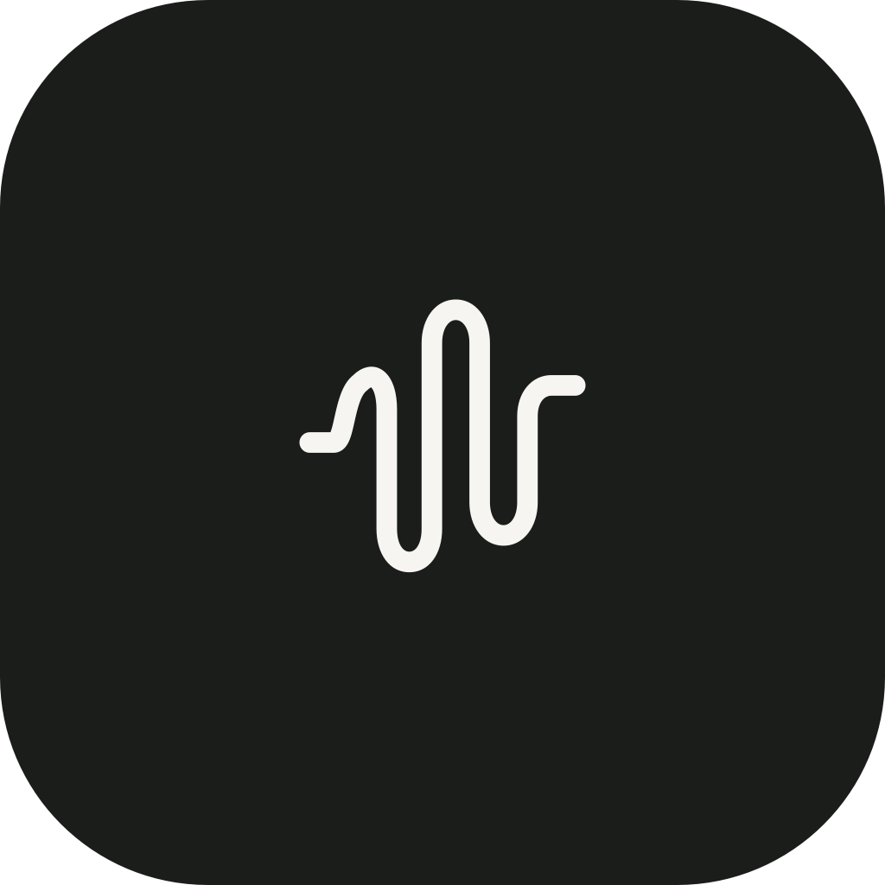
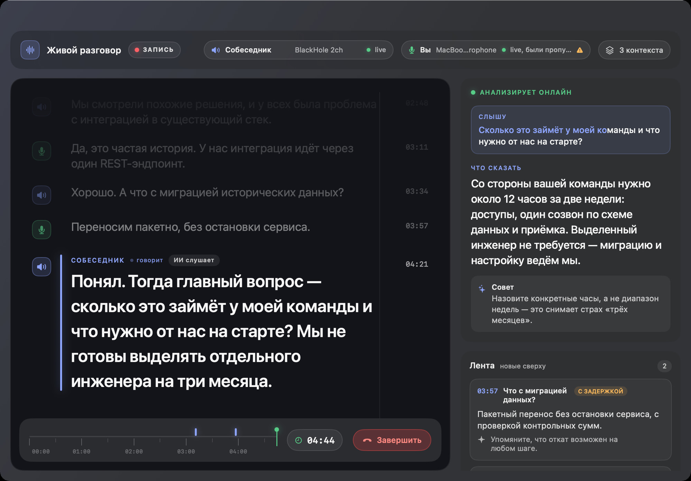

<p align="center">
  
</p>

<h1 align="center">Callya</h1>

<p align="center">
  Open-source native AI copilot for live calls on macOS and Windows.<br>
  It hears both sides, keeps the context, and suggests what to say next.
</p>

<p align="center">
  <a href="https://callya.kotlyar.chatgpt.site"><strong>Website</strong></a>
  ·
  <a href="https://github.com/kotlyar/ai-call-assistant/releases/latest/download/Callya.dmg"><strong>Download for macOS</strong></a>
  ·
  <a href="https://github.com/kotlyar/ai-call-assistant/releases/latest/download/Callya-Windows-win-x64.zip"><strong>Download for Windows</strong></a>
  ·
  <a href="https://github.com/kotlyar/ai-call-assistant/releases/latest">Release notes</a>
</p>

<p align="center">
  <a href="https://github.com/kotlyar/ai-call-assistant/actions/workflows/windows.yml"></a>
  <a href="LICENSE"></a>
  
  
</p>



## What Callya does

The current version implements the end-to-end local capture and OpenAI workflow:

- capture of either all system audio or a selected audio process through Core Audio process taps;
- recording from a real selected microphone through AVFoundation;
- separate `incoming.m4a` and `outgoing.m4a` tracks plus a mixed `combined.m4a` file;
- reusable call contexts with create, edit, delete, and per-call selection;
- independent real-time transcription sessions for the participant and microphone tracks;
- a compact floating teleprompter with full-dialogue, selected-context answers to every participant question;
- a durable post-call reconciliation pass over both raw recordings;
- final post-call question/answer cards built only from a fully reconciled conversation;
- a persistent recordings library with playback, separate audio export options, managed transcripts, processing states, and retry support.

## Downloads

| Platform | Build | Requirements |
| --- | --- | --- |
| macOS | [Callya.dmg](https://github.com/kotlyar/ai-call-assistant/releases/latest/download/Callya.dmg) · [ZIP](https://github.com/kotlyar/ai-call-assistant/releases/latest/download/Callya.zip) | macOS 14.2+, Apple Silicon or Intel |
| Windows | [Callya-Windows-win-x64.zip](https://github.com/kotlyar/ai-call-assistant/releases/latest/download/Callya-Windows-win-x64.zip) · [SHA-256](https://github.com/kotlyar/ai-call-assistant/releases/latest/download/Callya-Windows-win-x64.zip.sha256) | Windows 11 x64 |

The current macOS build is ad-hoc signed and not notarized; Gatekeeper may require **Privacy & Security → Open Anyway** on first launch. The Windows build is not code-signed, so SmartScreen may show an unknown-publisher warning. Build artifacts are also available on the [latest release page](https://github.com/kotlyar/ai-call-assistant/releases/latest).

## OpenAI API cost

Callya is free. You pay OpenAI directly through your own Platform API key. At prices current on 2026-09-02, a typical one-hour call costs approximately **$2.80–$3.30**: $2.04 for two live transcription tracks, $0.54 for post-call transcription of both tracks, and roughly $0.20–$0.70 for contextual answers and final analysis. The last part varies with the number of questions, transcript length, selected context, and response model. For a complete one-hour workflow, set the per-call limit to at least $3.50.

See the official pricing for [`gpt-live-transcribe`](https://developers.openai.com/api/docs/models/gpt-live-transcribe), [`gpt-transcribe`](https://developers.openai.com/api/docs/models/gpt-transcribe), and [`gpt-5.6-terra`](https://developers.openai.com/api/docs/models/gpt-5.6-terra).

The app uses an OpenAI Platform API key. A ChatGPT or Codex subscription is not an API credential and does not cover API usage. Enter the key once in Settings; it is stored at `~/Library/Application Support/com.aicallassistant.desktop/Secrets/openai-api-key` and reused on later launches. The app does not use Keychain or ask for your macOS password. The directory is restricted to `0700` and the file to `0600`, but the key is not separately encrypted: other processes running as the same macOS user, root, snapshots, or some backup tools may still read it. This convenience mode is therefore weaker than Keychain. Non-secret model, language, response-length, and per-call spending settings are also stored locally. Without a key, recording remains available while live and post-call cloud processing wait for credentials.

The reusable context library, including extracted attachment text and the current selection, is saved locally in `~/Library/Application Support/com.aicallassistant.desktop/contexts.json` and restored on the next launch. The directory is restricted to `0700` and the context file to `0600`.

## Requirements

- macOS 14.2 or newer
- Swift 5.9 or newer
- Xcode 15.1 or newer for IDE development

## Run the prototype

For UI development, open `Package.swift` in Xcode. Add an OpenAI Platform API key in the app's Settings window. Real capture should be tested from the app bundle so macOS can read its privacy usage descriptions.

## Build from source (macOS)

Maintainers: follow the [release runbook](docs/RELEASING.md) to create the
macOS artifacts and attach the tag-matched Windows package.

```bash
./Scripts/build-app.sh
open "dist/Callya.dmg"
```

The script produces `dist/Callya.app`, a clean universal ZIP, and a
read-only DMG for Apple Silicon and Intel Macs. It verifies the executable
permissions, both architecture slices, and the code signature after extracting
the final ZIP and mounting the final DMG. Send one of those artifacts as-is; do
not send the `.app` directory and do not compress it again in Finder. Prefer the
DMG if a messenger or cloud provider changes macOS bundle metadata during ZIP
extraction.

Without a configured certificate, the local bundle uses a stable ad-hoc
designated requirement so privacy permissions survive local rebuilds. For
a durable development or release identity, run:

```bash
AI_CALL_ASSISTANT_CODE_SIGN_IDENTITY="Apple Development: Your Name (…)" \
  ./Scripts/build-app.sh
```

Distribution still requires Developer ID signing and notarization. Until the app
has both, a trusted test user must try to open it once, then go to **System
Settings → Privacy & Security**, scroll to **Security**, choose **Open Anyway**,
and confirm. Keep a single copy in `/Applications` or `~/Applications`; changing
copies in a cloud-backed build folder can leave stale privacy permission
records.

On first launch, the app opens a permissions onboarding screen for Microphone and System Audio Recording. Each permission can be requested in place or opened directly in System Settings; the same screen remains available from the “Настроить доступы” button. Callya does not capture an image of the screen and does not require Screen Recording permission.

While the setup screen is open, Callya monitors only the selected microphone. Apart from the brief Core Audio probe used to request or verify permission, sustained system-audio capture starts after **Начать звонок** and stops when the call ends. During a call macOS can show its system-audio privacy indicator, but Callya does not create a screen-sharing session or a **Currently Sharing** control.

## Recording files

Each completed call is saved under `~/Documents/AI Call Assistant/<timestamp_uuid>/`:

```text
metadata.json
incoming.m4a
outgoing.m4a
combined.m4a
transcript.txt
transcript.live.json
transcript.canonical.<sha256>.json
spend-ledger.json
reconciliation/
final-analysis/
analysis.<revision>.<canonical-sha256>.json
```

`incoming.m4a` and `outgoing.m4a` are finalized and the recording metadata is saved before network finalization. Reconciliation and final analysis are durable jobs that resume after relaunch. `combined.m4a` is a best-effort convenience artifact; the two raw tracks remain authoritative.

The live and final prompts include the complete dialogue available for that perspective and the complete title and body of every context selected when the call started. The app does not silently summarize or truncate this input: if the configured model limit is exceeded, processing stops with an explicit status.

Run the test suite with:

```bash
swift test
```

When a browser is selected for a web call such as Google Meet, macOS captures audio at the application level. Other audible tabs in the same browser may therefore be included.

## Windows version

The separate native Windows 11 client lives in [`windows/`](windows/README.md). It uses .NET 10/WPF, WASAPI capture, encrypted DPAPI credential storage, Realtime transcription, a floating capture-protected teleprompter, and a self-contained `win-x64` ZIP build.
